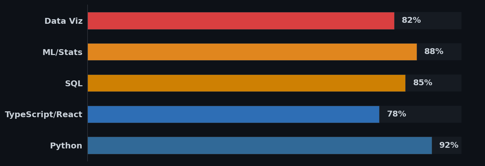
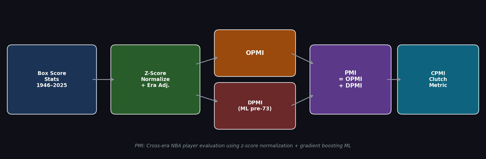
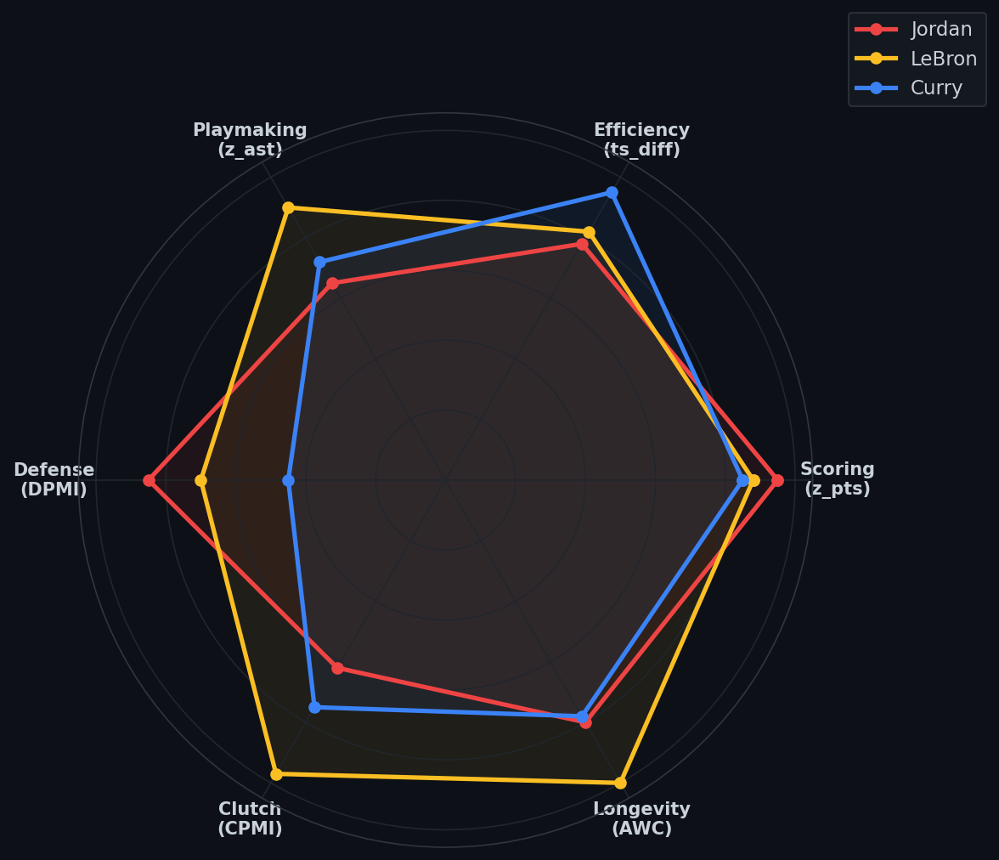
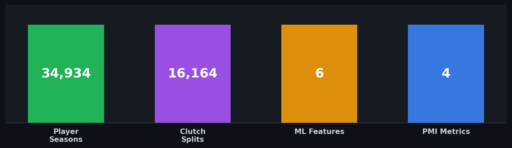

<div align="center">

<!-- ANIMATED HEADER -->


<br/>

[](mailto:Samir2000VIP@gmail.com)
[](https://www.linkedin.com/in/samir-kerkar-206132172/)
[](https://github.com/skerk001/court-vision-52)

</div>

---

### 👋 About Me

I'm a data scientist with a mathematics background from **UC Irvine** (B.S. Mathematics). I build things at the intersection of **statistical modeling**, **machine learning**, **clinical data**, and **sports analytics** — turning messy real-world data into systems that surface genuine insight.

Previously at **Desert Oasis Healthcare**, I analyzed EHR data across 50,000+ patients and 20+ facilities, built predictive models (AUROC 0.72), and co-authored research presented at **ASHP national conferences**. Currently pursuing my M.S. in Data Science.


<table>
<tr><td>📍</td><td>Southern California</td></tr>
<tr><td>🎓</td><td>B.S. Mathematics — UC Irvine · M.S. Data Science (incoming)</td></tr>
<tr><td>🔭</td><td>Building <b>Courtside</b> — a cross-era NBA player evaluation platform</td></tr>
<tr><td>💡</td><td>NBA Analytics · ML/Statistical Modeling · Healthcare Data · Chess</td></tr>
</table>

---


---

### 🔧 Tech Stack

<div align="center">


</div>

<div align="center">

</div>

---

### 🏀 Featured Project: Courtside

> **A proprietary NBA analytics platform evaluating every player in league history (1946–2025) on a unified scale.**

<div align="center">

</div>

**The PMI (Player Metric Index)** is a composite metric system I designed from scratch that solves three hard problems in basketball analytics:

| Challenge | Solution |
|-----------|----------|
| Cross-era stat inflation | Within-season z-score normalization + graduated era penalties |
| Missing data before 1973 | ML imputation via `GradientBoostingRegressor` for defensive metrics |
| Position bias | Continuous position interpolation (1–5 scale) instead of discrete buckets |

```
PMI = OPMI + DPMI

OPMI = Σ w(pos, stat) · clip(z_stat, -3.0, +3.0) × era_penalty(season)
DPMI = (w_stl·z_stl + w_blk·z_blk + w_drb·z_drb + w_pf·z_pf) × 0.72
CPMI = 1.50·z_ppg + 0.40·z_apg + 0.35·z_ts + 0.50·z_±  — clutch metric (last 5 min ±5 pts)
```

<div align="center">

<br/>
<em>PMI component comparison: Jordan vs LeBron vs Curry</em>
</div>

<br/>

<div align="center">

</div>

<div align="center">

| Regular Season | Playoffs |
|:-:|:-:|
| 🥇 Jordan **+10.96** | 🥇 LeBron **+13.54** |
| 🥈 LeBron **+10.81** | 🥈 Jordan **+11.99** |
| 🥉 Curry **+10.23** | 🥉 Jokić **+10.65** |

</div>

**Tech:** Python · Flask · React · TypeScript · scikit-learn · Tailwind CSS · NBA API · Basketball Reference

[](https://github.com/skerk001/court-vision-52)
[-3b82f6?style=for-the-badge)](https://github.com/skerk001/court-vision-52/blob/main/docs/PMI_Research_Paper.pdf)

---
---

---

### 👁️ Featured Research: Diabetic Retinopathy Classification

> **Deep learning computer vision system for automated detection of diabetic retinopathy severity from retinal fundus images.**

Built during undergraduate research at **UC Irvine**, this project trained convolutional neural networks (TensorFlow/Keras) on 5,000+ labeled retinal images for multi-class severity classification. The model achieved **F1 = 0.94** across all severity grades through systematic architecture search, data augmentation, and held-out cross-validation.

| Component | Details |
|-----------|---------|
| 🧠 Model | Custom CNN architecture (TensorFlow/Keras) |
| 📊 Dataset | 5,000+ labeled retinal fundus images across 5 severity classes |
| 🎯 Performance | **F1 = 0.94** with robust generalization across severity grades |
| 🔬 Methods | Transfer learning, data augmentation, hyperparameter tuning, error analysis |

<div align="center">


<br/>


</div>

**Tech:** Python · TensorFlow · Keras · NumPy · OpenCV · Matplotlib

<div align="center">

[](https://github.com/skerk001/diabetic-retinopathy-classification)
[-ef4444?style=for-the-badge)](https://github.com/skerk001/diabetic-retinopathy-classification/blob/main/DR_Classification_CNN_Research_Paper.pdf)

</div>
---

### 📊 Other Projects

<table>
<tr>
<td width="50%" valign="top">

#### 🏥 Healthcare Outcomes Research
Statistical analysis across 50,000+ patients at Desert Oasis Healthcare. COPD cost-effectiveness study showing **$83.50 PMPM savings**. Regression-based hospital readmission analysis and atrial fibrillation care gap identification. Co-authored research presented at **ASHP 2024**.

`Python` `R` `SQL` `Regression` `NLP`

</td>
<td width="50%" valign="top">

#### [🔬 ML Cancer Prediction](https://github.com/skerk001/gene-cancer-prediction)
Gene expression cancer classification using machine learning. Built predictive models on high-dimensional genomic data achieving **96% classification accuracy** on 100,000+ NIH chest X-ray images.

`scikit-learn` `TensorFlow` `Classification`

</td>
</tr>
<tr>
<td width="50%" valign="top">

#### [🏠 Real Estate Condition Prediction](https://github.com/skerk001/real-estate-condition-prediction)
Machine learning model to predict property condition ratings from real estate listing data. Feature engineering on housing attributes to classify property conditions for valuation and investment analysis.

`Python` `scikit-learn` `Pandas` `Feature Engineering`

</td>
<td width="50%" valign="top">

#### ♟️ Chess Meme Tower Defense
A Clash Royale-style tower defense game with 3 lanes, chess piece troops, meme characters (LeBron, Harambe, Doge, Pepe, Shrek), spells, and castle upgrades. Built with custom game AI and sprite-based animations.

`JavaScript` `HTML5 Canvas` `Game AI`

</td>
</tr>
</table>
---


*"How do you compare a 1962 Wilt Chamberlain season to a 2024 Nikola Jokić season?*
*The same way — by measuring how far each deviated from their peers."*


</div>
